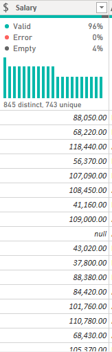

# PALMORIA-VISUAL-ANALYSIS

palmoria dashboard
:-------------------------:

## INTRODUCTION
  Palmoria Group is a manufacturing company based in Nigeria that has an embroided issues about gender inequality in its 3 regions where there businesses are located. Unfortunately, the media recently published in the news with the headline **_"Palmoria, the Manufacturing Patriarchy"_** this doesn’t look good to the owner of the business on their ambition to scale the business to other regions and even overseas.
 **_Disclaimer_**: All datasets and reports do not represent any company, institution or country, but just a dummy datasets to demonstrate capabilities of Power BI

This documentation outlines the data cleaning process for the Palmoria group Business 
A 3 sets of data was given to work on and to know about the issues the company is currently facing. The datasets are given below;

The **_bonus mapping_** : This contains the rule for making payments to the employees in the company and their work rating

The **_bonus rules_** : this contains the rule for making payments to the employees in the company and their work rating

The **_DSF_emp_data_** : this contains the employees details 
I looked into the data set and the data cleaning process was completed using Power Query, a powerful data transformation tool and I analyzed and generate an insights the management team need to address  

## Problem Statement
1. What is the gender distribution in the organization? Distil to
regions and departments
2. Show insights on ratings based on gender
3. Analyse the company’s salary structure. Identify if there is a
gender pay gap. If there is, identify the department and
regions that should be the focus of management
4. A recent regulation was adopted which requires
manufacturing companies to pay employees a minimum of
$90,000
- Does Palmoria meet this requirement?
- Show pay distribution of employees grouped by a band of
$10,000.
- allocate the annual bonus pay to employees based on the performance rating. 
- calculate the amount to be paid as bonus to individual
employees
- Calculate the total amount to be paid to individual employees
(salary inclusive of bonus)
- Total amount to be paid out per region and company-wide

## DATA Description;
  The Palmoria Group manufacturing company gave out a data set of 3 different tables which are the bonus mapping, bonus rules and the DSF_emp-data. The bonus mapping and bonus rules consists of 12 rows and 6 columns while the DSF_emp_data consists of 6 columns and 1015 rows..
The **_DSF_emp_data tables_** contains a range of the employees details related to the Palmoria company staffs, such as Employees name, Gender, department, salary, location and rating 
While the **_bonus rules and mappings_** which are the same consist of 12 rows and 6 columns .The columns consists of the department and the ratings ie very poor, poor, very good, good and average.

## Skills/ concepts demonstrated
- DAX
- Qucik Measures,
- Page Navigation
- Modelling
- Filters

## Data Cleaning Process
Using M language and a host of tools available in Power Query Editor, I was able to perform the following transformation to the data set

### Text Cleaning 
One of the issues identified during the data cleaning process was with the “Gender” column. The column contains male, female and blank so I replaced the blank with Undisclosed. The power query replaced values was used. [See preview below;]

before column         |       after column
:--------------------:|:-------------------:
|

### Department column
There are few rows that has a “NULL” text in the column so I removed it by unchecking it from the list of other department rows. Which gives our rows to reduce to 987 rows [See preview below;]

before column         |       after column
:--------------------:|:-------------------:
|

### Salary Column
There are few rows that has a “null” text in the column so I removed it by unchecking it from the list of other salary rows. Which gives our rows to reduce to 946 rows 
[See preview below;]

before column      |       after column
:-----------------:|:-------------------:
|

### Salary band column
This is a column where our condition statement was done by grouping each band into their various categories ..ie an IF statement ;
For example;
if [Salary] <= 60000 then "band 3" else "band 3")
. [See preview below;]

Salary band
:------------------:

### Merge table
I created a merge table to be able to get the employee who’s worthy of a bonus base on their performance rating so I was able to merge the DSF_emp_data and the bonus rules table together. I merged them by joining their unique identifier which is the “Department” column so that gives me the bonus discount column [See preview below;]

Merged
:-------------:

## Modelling
Automatically derieved relaionships are adjusted to remove and replace unwanted relationships with the required.

Auto model         |       Adjusted model
:-----------------:|:---------------------:
|

The model is a star schema
There are 2-dimensional tables and 1 fact table. The dimension tables are all joined to the fact table (auto-detect) with a one-to-many relationships
but after i merged the DSF_emp_data to the bonus rules table i adjusted the model which gives a many-to-many relationships.

## CONCLUSIONS
**_Gender Distribution_**
•	The gender disparity is most prominent in the Kaduna region (M-F ratio: 182-165), followed by Lagos (M-F ratio: 124-118) and then Abuja which has a negligible gender disparity (M-F ratio: 159-158).
•	Of the 12 departments, 7 have a higher Male headcount, with the Legal department leading the pack (M-F ratio: 49-34).
•	Overall, the gender disparity across the company is considered ‘MARGINAL’.

**_Salary Structure_**
•	A gender pay gap exists across all regions of the company; at an average M-F salary ratio of $74.8k – $72.1k, male employees were noted to earn slightly more in all regions. 
•	Male employees earned more in total terms across 7 (out of 12) departments. On an average salary basis, Male employees earned more in 9 (out of 12) departments across the company. 
•	Given the marginal pay gap, there isn’t sufficient evidence based on available data to conclude if the disparity is reflective of patriarchy.
•	Performance Ratings & Bonuses
•	Female employees overall performed better in the period under review (reflected in higher overall bonuses which accrued to females).

## RECOMMENDATIONS
•	Given the minimality of the gender disparity & pay gap, PALMORIA should consider reviewing its employment and remuneration policy to close the inherent gender gaps and neutralize current negative opinions.
•	PALMORIA should consider reviewing the salary structure across the company to meet the minimum wage requirement.

